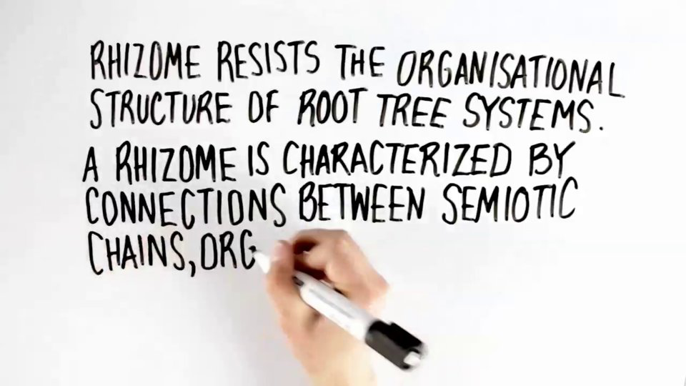

The Personal Portable Library in its most simple form is a hard drive or
USB stick containing a large collection of e-books, curated, archived
and indexed by an individual user. The flourishing of the offline
digital library is a response to the fact that truly private sharing of
knowledge in the online realm is increasingly made impossible. While P2P
sharing sites and online libraries with downloadable e-books are
precarious, people are led to an atavistic and reversalist workaround.
The radical tactics of the offline: abandoning the online for more
secure offline transfer. Taking inspiration from ancient libraries as
copying centers and Sneakernet, Henry Warwick describes the future of
the library as digital and offline. *Radical Tactics of the Offline
Library* traces the history of the library and the importance of the
Personal Portable Library in sharing knowledge and resisting
proprietarian forces.

The library in Alexandria contained about 500,000 scrolls; the Library
of Congress, the largest library in the history of civilization,
contains about 35 million publications. A digital version of it would
fit on a 24 terabyte array, which can be purchased for about \$2000.
Obviously, most people don’t need 35 million books. A small local
library of 10,000 books could fit on a 64 GB thumb drive the size of a
pack of chewing gum and costing perhaps \$40. This is an astounding fact
with immense implications. It is trivially simple to start collecting
e-books, and then to share the results. And it is much less trivially
important. Sharing is caring. Societies where people share, especially
ideas, are societies that will naturally flourish.

Henry Warwick is an assistant professor at the RTA School of Media at
Ryerson University, in Toronto, where he teaches media and
communications theory and audio production. An artist and musician, much
of his work can be accessed for free at
[kether.com](http://kether.com/). He likes to collect books and music
and build libraries.

Watch The Radical Tactics of the Offline Library video on
[http://vimeo.com/95351775](http://vimeo.com/95351775)

